# Ứng Dụng Quản Lý Đặt Lịch Cắt Tóc (Android)

## Tổng quan

Ứng dụng Android này là một hệ thống quản lý đặt lịch cắt tóc được thiết kế để tối ưu hóa quy trình đặt lịch cho cả thợ cắt tóc và khách hàng của họ. Ứng dụng cho phép chủ quán quản lý lịch hẹn, xem các khung giờ trống và quản lý lịch đặt của họ, Phần mềm phục vụ đối tượng chính là các chủ barber

## Tính Năng

### Tính Năng Dành Cho Thợ Cắt Tóc:

*   **Quản Lý Lịch Làm Việc:** Thiết lập và điều chỉnh giờ làm việc và các khung giờ trống.
*   **Xem Lịch Đặt:** Xem tất cả các lịch hẹn sắp tới và thông tin chi tiết của khách hàng.
*   **Quản Lý Khách Hàng:** Xem và quản lý danh sách khách hàng của mình.
*   **Xác Thực Người Dùng:** Đăng nhập an toàn bằng Firebase Authentication.
*   **Quản Lý Hồ Sơ:** Cập nhật chi tiết dịch vụ và thông tin doanh nghiệp.
*   **Phản Hồi Yêu Cầu Đặt Lịch:** Xem xét và phê duyệt hoặc từ chối các yêu cầu đặt lịch.

## Công Nghệ Sử Dụng

*   **Android Studio:** IDE chính để phát triển Android.
*   **Java:** Ngôn ngữ lập trình cốt lõi cho ứng dụng Android.
*   **Firebase:**
    *   **Firestore:** Để lưu trữ dữ liệu theo thời gian thực.
    *   **Authentication:** Để xác thực và quản lý người dùng.
*   **Facebook SDK:** Để gửi thông báo qua Facebook Messenger.
*   **Gradle:** Để quản lý các phụ thuộc và quy trình xây dựng.
*   **nodeJS:** Để xây dựng backend cho app và endpoint chính để tương tác với facebook messenger bussiness
*   **Khung giao diện người dùng:**
    *   **Bố cục Android:** Để thiết kế giao diện người dùng.

## Demo Ứng dụng

### Đăng nhập

  
  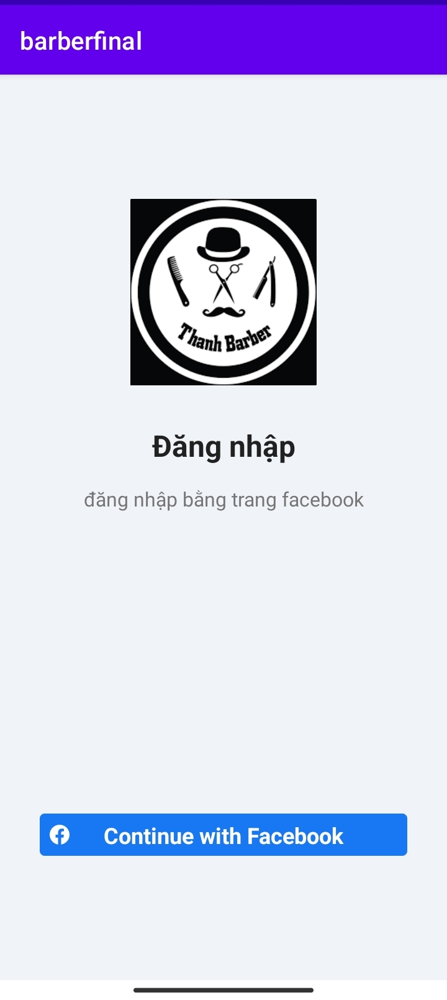

### Trang chủ 

  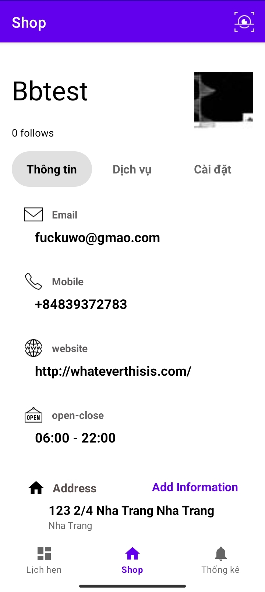
  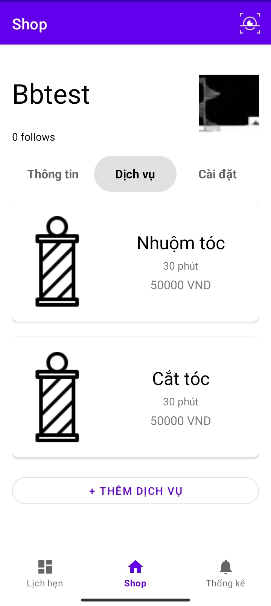
  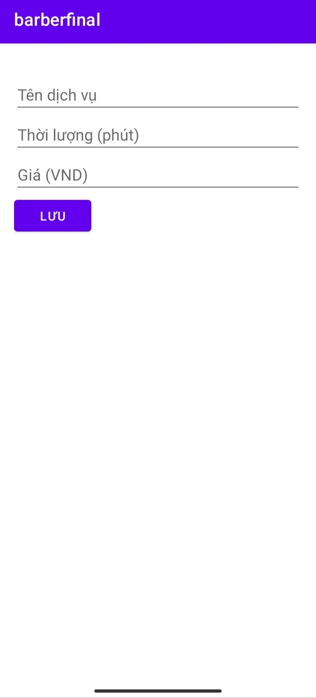

### Lịch hẹn 

  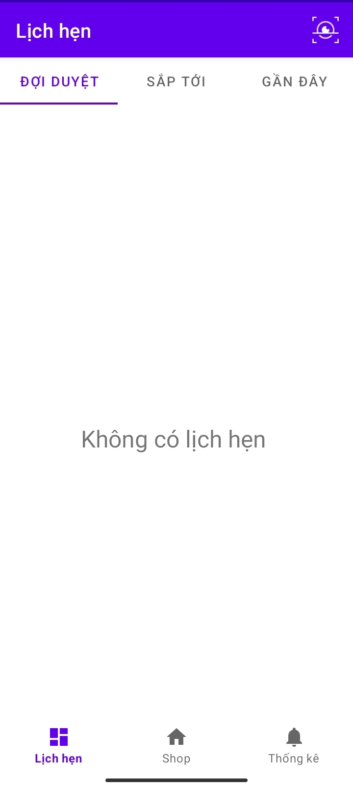
  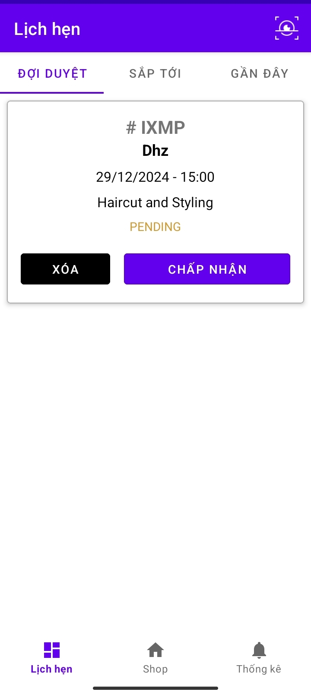
  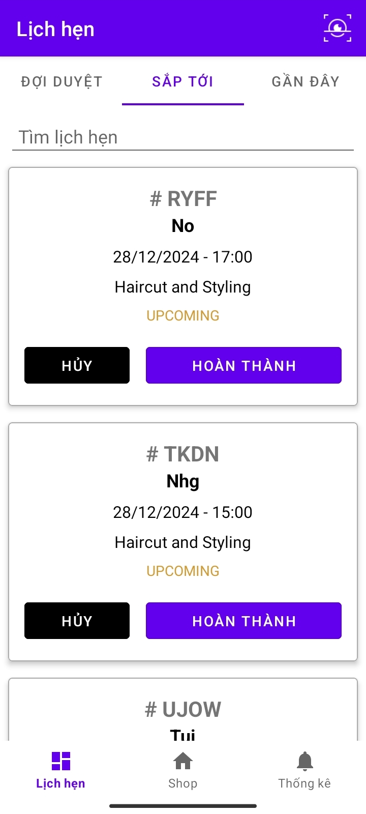
  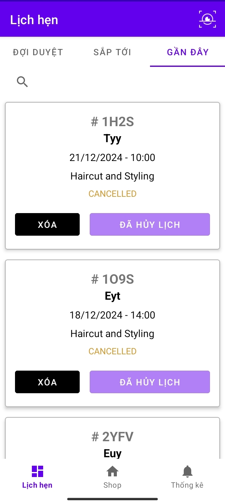

### Tìm kiếm, lọc

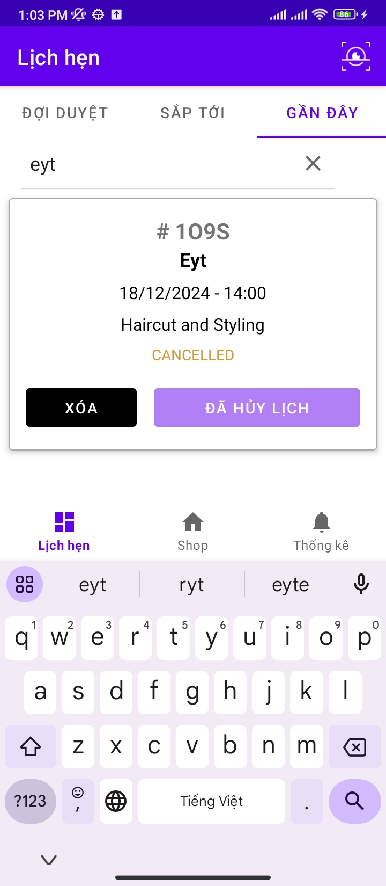

### Chi tiết

  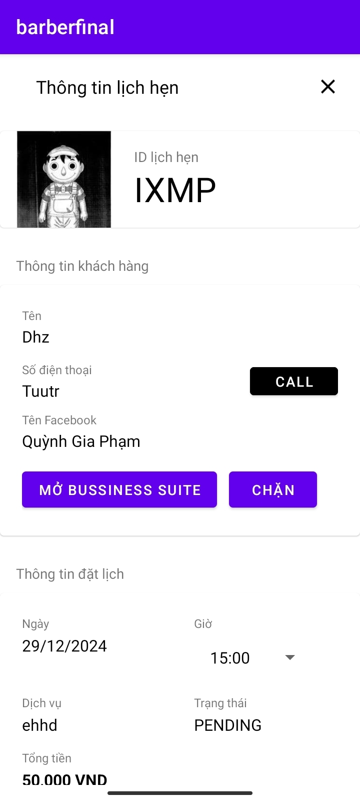
  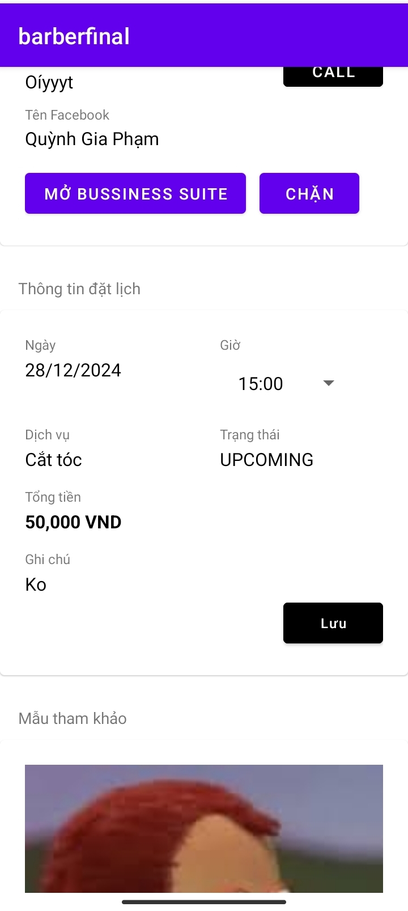
  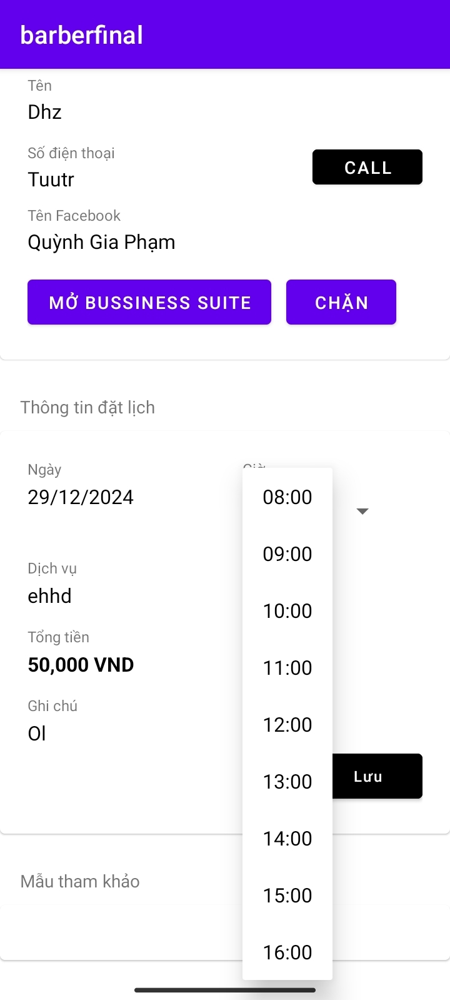
  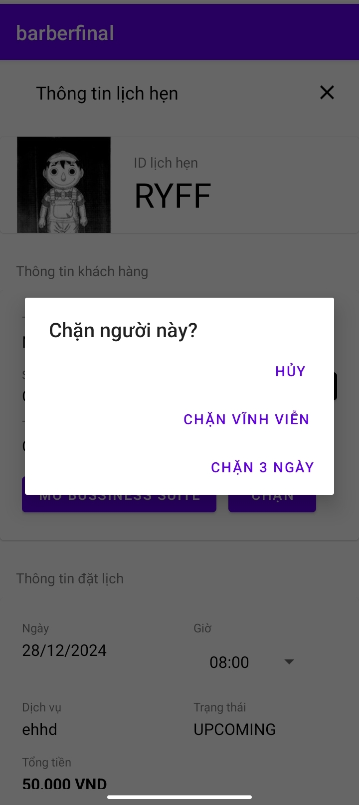

### Lịch biểu

### Nguời dùng đặt Lịch

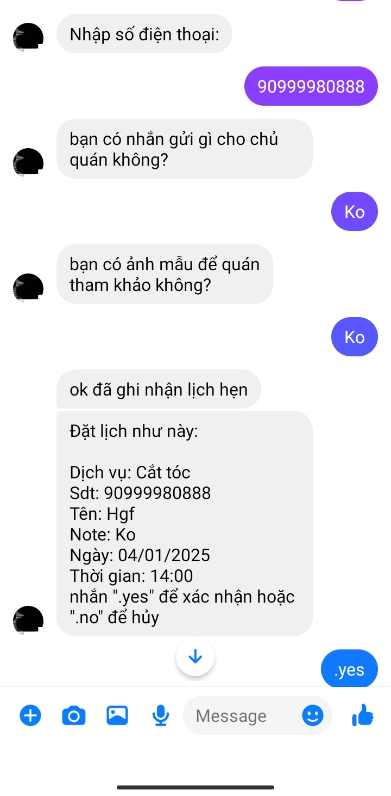
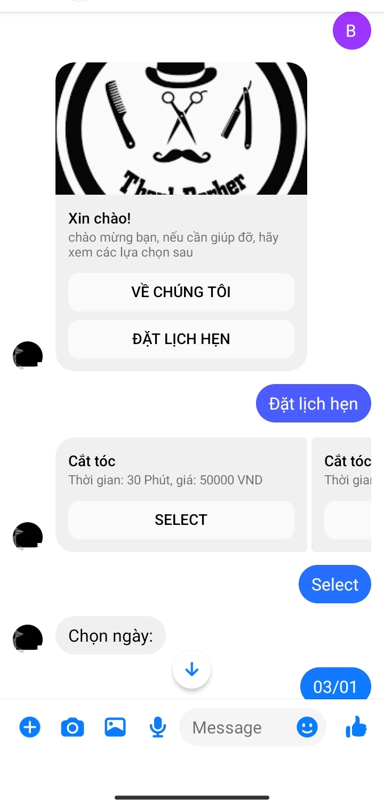

